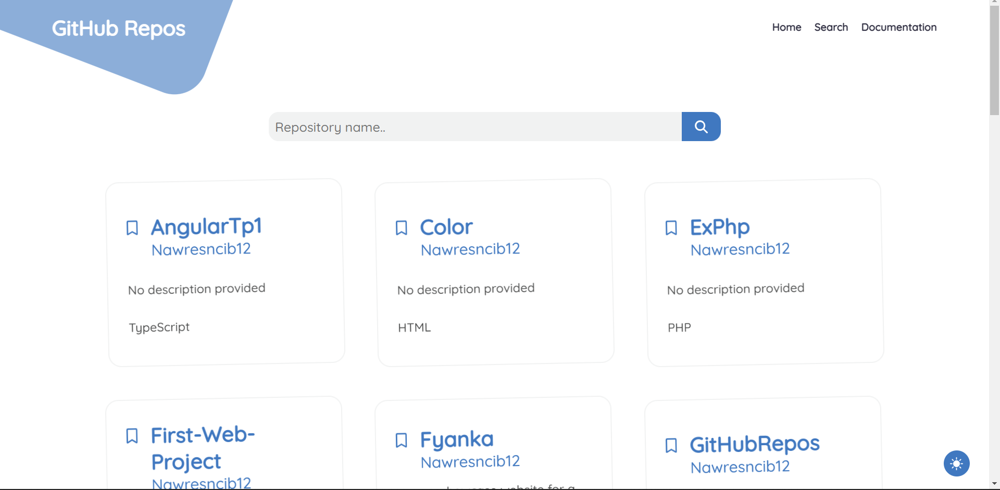

<h1 align="center">
  Github Repos
</h1>
<p align="center" style="font-size: 15px;">A web application that fetches and filters public github repositories of a specific user using his github username.</p>
🔗 <a align="center" style="font-size: 15px;"href="https://github.com/nawresncib12"> Live Demo</a>
<br/>



<hr/>

### 💻 Technologies Used:
<br/>

This application is written using :

- React.js ⚛️

<hr/>

### 👨‍💻 Installation and Setup Instructions :
<br/>

You will need node and npm installed globally on your machine.

### Installation:

1. Clone this repository
   ```
   git clone https://github.com/nawresncib12/GitHubRepos.git
   ```
2. Install NPM packages
   ```
   npm install
   ```

### Running the application:

```
npm start
```

### Running test suites:

```
npm run test
```

### Storybook:

This project includes storybook, a frontend workshop for building UI components and pages in isolation.

- Run the following command and see the stories :

  ```
  npm run storybook
  ```

<hr/>

### 📶 Future improvements:

<br/>
This project is still open for improvements.
<br/>
Suggested features and fixes include:

- Adding more filters to repository search .
- Adding ordering options ( Order results by creation date, by name...) .
- Creating a multi-language experience (English and German).
- Improving the dark mode experience.
<hr/>

### ✨ Feedback:
<br/>